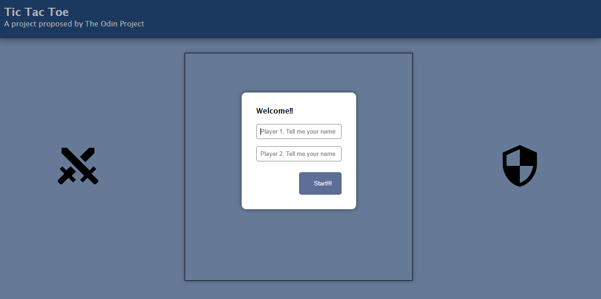
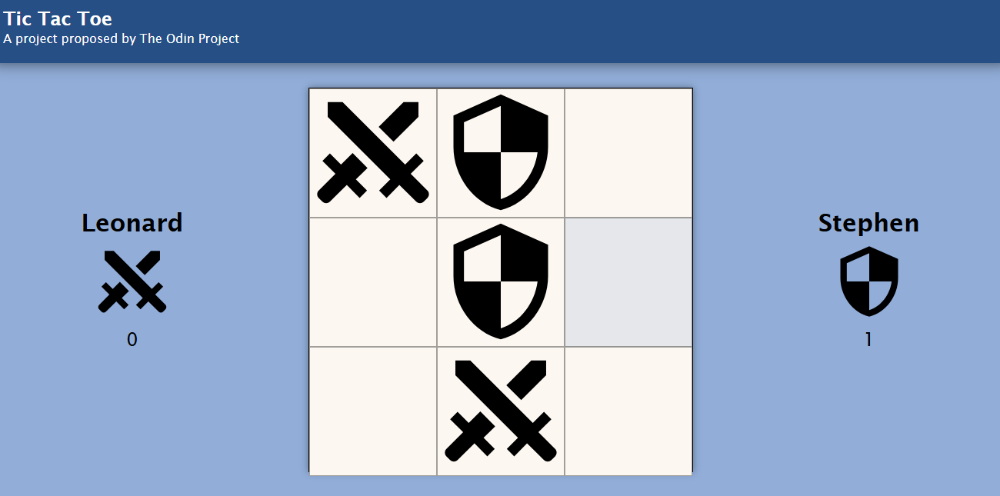
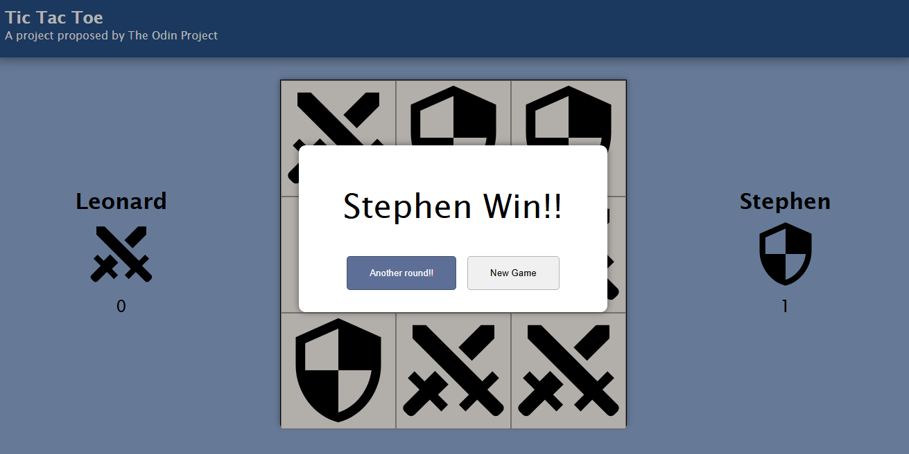

# Tic Tac Toe Game

## Description
This is a Tic Tac Toe game developed as a learning project. It allows two players to compete in a Tic Tac Toe match in the browser. The project is structured using ES6 modules for better organization and maintainability of the code.

## Features
- Interactive game for two players
- Coordinate validation to ensure valid moves
- Player score tracking
- Responsive user interface
- Modal for entering player names
- Game result messages (winner or tie)
- Functionality to reset the game and start new matches

## Technologies Used
- HTML
- CSS
- JavaScript (ES6)
- Git and GitHub for version control

## How to Run the Project

1. Clone the repository:
   ```bash
   git clone https://github.com/AlcaldeLeonardo/tic-tac-toe-game.git

2. Navigate to the project directory:
   ```bash
    cd tic-tac-toe
   ```
    
3. Open the projetc directory in your preferred editor.

## ScreenShots
### Start Menu



### In Game


### Result Screen


## Use of Git and GitHub
This project uses Git for version control and GitHub to host the repository. Some of the best practices followed include:
- Frequent and descriptive commits
- Use of branches for new features and bug fixes
- Pull requests for code review
- Issues for task and bug tracking

## Contributions
Contributions are welcome. Please open an issue or send a pull request to discuss any major changes.


## Contact
For any questions or suggestions, please contact [leonardoalcalde020@gmail.com](mailto:leonardoalcalde020@gmail.com).

---

Thank you for visiting this project! If you like it, please give it a star on GitHub.

